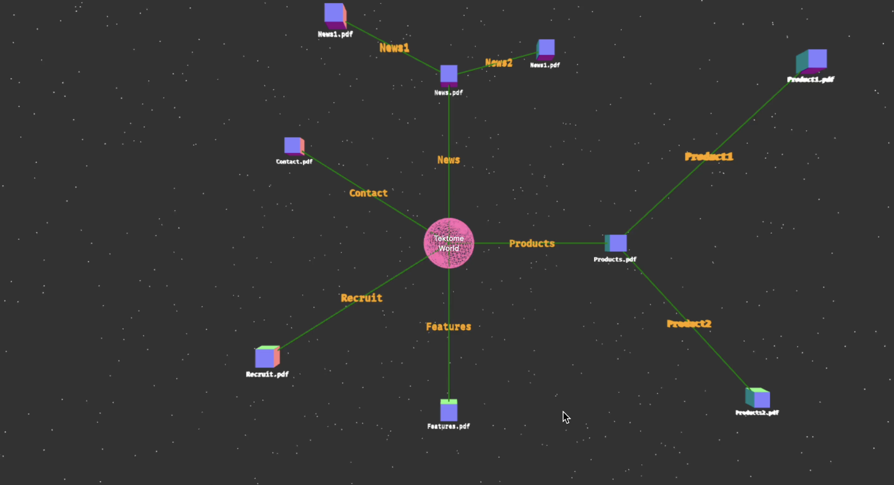

# Tektome Assignment
#### I have completed the assignment. 
[Watch the video](https://www.youtube.com/watch?v=wnOu0L3xOO4)

Or click the thumbnail below to watch it:

<a href="https://www.youtube.com/watch?v=wnOu0L3xOO4" target="_blank" rel="noopener noreferrer">
  
</a>


## Recommended IDE Setup

[VSCode](https://code.visualstudio.com/) + [Volar](https://marketplace.visualstudio.com/items?itemName=Vue.volar) (and disable Vetur).


##  :computer: Running

#### Install the dependencies
```sh
npm install
```

#### Compile and Hot-Reload for Development

```sh
npm run dev
```
```sh
http://localhost:5173
```
#### :green_book: Library Used


 :pen: Typescript
 :pen: TresJS (for 3D rendering)
 :pen: Vue3 (for building UI)
 :pen: Pinia (State Management)


## :hook: Consideration

As per the assignment, I thought it's better to build something useful for Tektome.
So, I grabbed the PDF for different parts of the webpage and make them as a Node, and connection between different parts is done by Edges.




## :toolbox: Functionality and Design

1. All the Nodes and Edges are 3D object,Text on the Edges is 3D Text. `Tektome World` is a 2D Text i.e., HTML rendered inside 3D space

2. Clicking on the Node will open the PDF

3. Clicking on the Text oin edges will open an Editable Box in which we can enter new text for the edge.

## :rocket: Assignment Requirements
#### The project is developed by keeping in mind all the necessary requirements of the assignments.


1. Node Visualization (Requirement 1): Each node is a 3D node and is clickable with name of the file written below. :white_check_mark:

2. Edge Visualization (Requirement 2): Based on the data the edge is connected between the nodes. The text(3D) of present in the edge represents the relation between nodes and is editable. :white_check_mark:

3. User Interaction (Requirement 3): Use can easily interact with nodes and edges(zoom, pan the view and rotate). :white_check_mark:


## Thanks for the assignment
I totally enjoyed doing it, and learned several new things.


